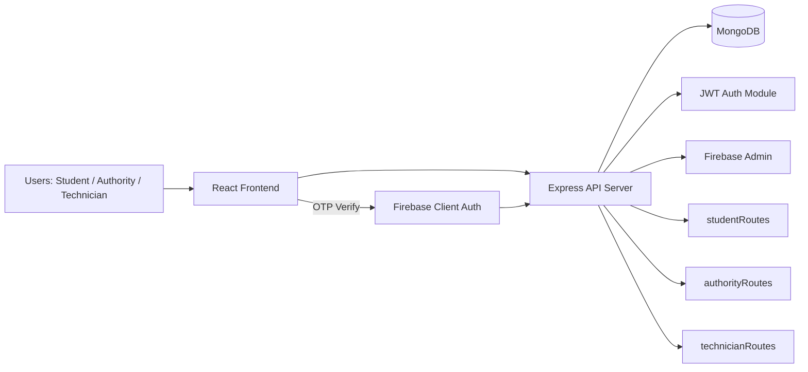

# Electricity Complaint Management System (VoltFix)

This is a full-stack complaint management platform for hostel and campus maintenance workflows.
It supports 3 roles:

- Student: create and track complaints.
- Authority: review complaints and assign technicians.
- Technician: view assigned tasks and mark them resolved.

The goal is to reduce manual follow-up and make complaint handling transparent from reporting to resolution.

## What Is Implemented In This Project

### Backend (Node.js + Express + MongoDB)

- Role-based authentication using JWT.
- Password hashing with `bcrypt` for Student, Authority, and Technician models.
- Complaint APIs for submit, list, approve, assign, and resolve flows.
- Cookie-based JWT handling for protected routes.
- Firebase Admin setup for OTP-based password reset verification.
- MongoDB models for all core entities.

### Frontend (React + Vite + Tailwind)

- Separate login experiences for Student, Authority, and Technician.
- Student pages: signup, login, dashboard, raise complaint, complaint history.
- Authority pages: complaint list, complaint review, technician assignment.
- Technician pages: assigned jobs list, complaint detail, resolve action.
- Shared layout with sidebar navigation and role portal header.

### Security and Auth

- JWT token is issued after login/signup and stored as an `httpOnly` cookie.
- Role checks are applied in critical authority and technician APIs.
- OTP flow for password reset is integrated using Firebase Phone Auth.

## End-to-End Role Flow

### Student Flow

1. Student signs up or logs in.
2. Student submits a complaint with room, category, and description.
3. Student tracks complaint status from history screen.

### Authority Flow

1. Authority logs in using `authorityId` and password.
2. Authority reviews pending complaints.
3. Authority approves complaint.
4. Authority assigns a technician.

### Technician Flow

1. Technician logs in with email and password.
2. Technician sees assigned complaints.
3. Technician opens complaint details.
4. Technician marks complaint as resolved.

## Complaint Lifecycle

```text
pending -> approved -> assigned -> resolved
```

Status values supported by schema:

- `pending`
- `approved`
- `assigned`
- `resolved`
- `rejected`

## Architecture Flowchart



## Project Structure (Easy View)

```text
Electricity-complaint-management-system/
|- index.js                     # Express app entry
|- jwt.js                       # JWT generate/verify middleware
|- firebaseAdmin.js             # Firebase admin initialization
|- seedauthority.js             # Seed authority user
|- seedtechnician.js            # Seed technician user
|- models/
|  |- student.js
|  |- authority.js
|  |- technician.js
|  |- complaint.js
|- routes/
|  |- studentRoutes.js
|  |- authorityRoutes.js
|  |- technicianRoutes.js
|- middleware/
|  |- verifyFirebaseToken.js
|- config/
|  |- firebaseServiceAccount.json
|- Frontend/
|  |- src/
|  |  |- App.jsx                # Route map
|  |  |- api/axios.jsx          # Axios client config
|  |  |- firebase/firebase.js   # Firebase client config
|  |  |- components/layout/
|  |  |- pages/student/
|  |  |- pages/authority/
|  |  |- pages/techdashboard.jsx
|  |  |- pages/technicianlogin.jsx
|  |  |- pages/ComplaintDetail.jsx
|  |  |- pages/ResetPassword.jsx
```

## API Overview

### Student APIs (`/student`)

- `POST /signup` - register new student
- `POST /login` - login student
- `GET /dashboard` - protected student dashboard data
- `POST /complaint` - protected complaint submission
- `GET /complaints` - protected complaint list
- `POST /reset-password` - reset password via Firebase token

### Authority APIs (`/auth`)

- `POST /login` - authority login
- `GET /complaints` - protected complaint list
- `GET /complaints/:id` - protected complaint detail
- `PUT /complaints/:id/approve` - approve complaint
- `GET /technicians` - list technicians
- `PUT /complaints/:id/assign` - assign technician

### Technician APIs (`/technician`)

- `POST /login` - technician login
- `GET /complaints` - assigned complaints
- `GET /complaints/:id` - single complaint details
- `PUT /complaints/:id/resolve` - mark complaint resolved

## Tech Stack

- Frontend: React 19, Vite, Tailwind CSS, Axios, React Router.
- Backend: Node.js, Express, Mongoose.
- Database: MongoDB.
- Auth: JWT + Firebase OTP verification.

## Local Setup

### 1. Install dependencies

From project root:

```bash
npm install
```

From frontend folder:

```bash
cd Frontend
npm install
```

### 2. Configure environment variables

Backend (`.env` at project root):

```env
PORT=3000
MONGO_URI=mongodb://127.0.0.1:27017/ElectroDB
JWT_SECRET=your_jwt_secret
ALLOWED_ORIGINS=http://localhost:5173
FIREBASE_SERVICE_ACCOUNT_PATH=./config/firebaseServiceAccount.json
```

Frontend (`Frontend/.env`):

```env
VITE_API_BASE_URL=http://localhost:3000
```

### 3. Run backend

```bash
npm run dev
```

### 4. Run frontend

```bash
cd Frontend
npm run dev
```

Default URLs:

- Frontend: `http://localhost:5173`
- Backend: `http://localhost:3000`

## Seed Demo Data (Optional)

Run from project root:

```bash
node seedauthority.js
node seedtechnician.js
```

Sample credentials used in seed files:

- Authority: `authorityId: AUTH001`, password `Admin@123`
- Technician: `email: t@gmail.com`, password `Tech@1234`

## Important Implementation Notes

- CORS is configured in `index.js` with support for local frontend and a Render domain.
- JWT middleware currently reads token from cookies (`req.cookies.token`).
- Frontend also stores token and role info in `localStorage` for UI state.
- Firebase service account can be loaded from JSON string, custom path, or default config file.

## Future Enhancements

- Add reject complaint API route to match authority UI action.
- Add stricter validation and centralized error handling.
- Add admin analytics for category-wise and hostel-wise complaint trends.
- Add tests for routes, auth middleware, and model validation.
